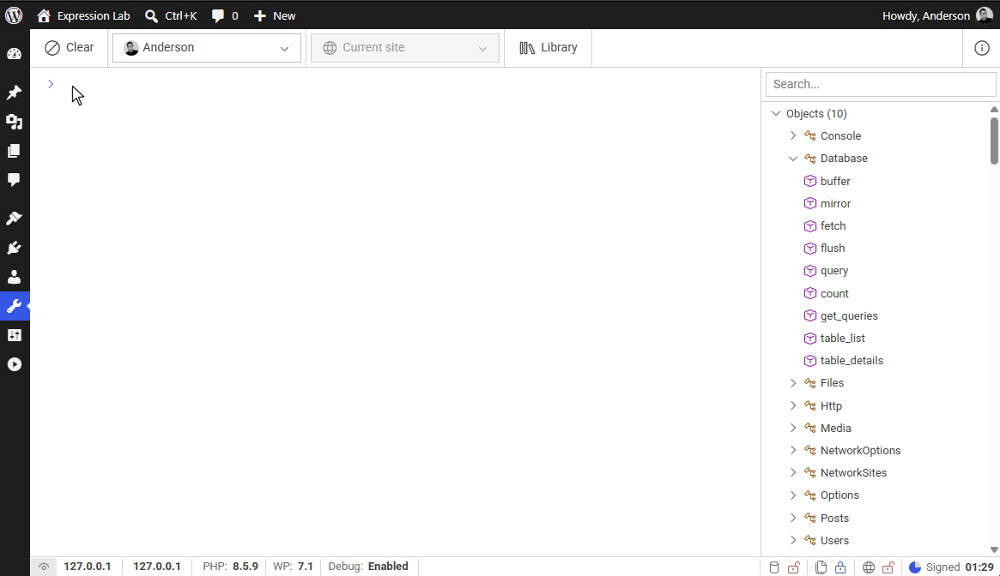
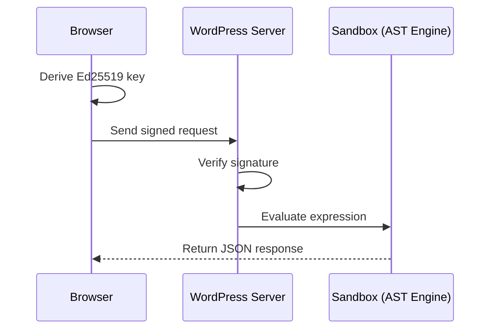

<p align="center">
  <a href="https://expressionlab.io" target="_blank" rel="noopener noreferrer">
    
  </a>
</p>

<h1 align="center">Expression Lab</h1>

<p align="center">
  <strong>An interactive diagnostics console and declarative DSL for WordPress.</strong>
</p>

<p align="center">
  <a href="https://github.com/andersonsalas/expressionlab/actions/workflows/lint.yml"></a>
  <a href="https://github.com/andersonsalas/expressionlab/actions/workflows/test-php.yml"></a>
  <a href="https://github.com/andersonsalas/expressionlab/actions/workflows/test-js.yml"></a>
  
  
  
  <a href="LICENSE"></a>
</p>

---

**Expression Lab** is an experimental in-browser console for exploring WordPress data. Powered by a declarative Domain-Specific Language (DSL), it enables inspecting posts, options, database tables, and files without writing raw PHP snippets.

<p align="center">
  
</p>

In WordPress development, troubleshooting often relies on ad-hoc PHP code execution, temporary `var_dump()` calls, or console plugins based on `eval()`. In production sites, unconstrained execution carries inherent risks: accidental database writes, memory exhaustion, or security exposure.

Expression Lab explores an alternative approach:

* Evaluating **DSL expressions** via an **Abstract Syntax Tree (AST)** powered by an extended [Symfony Expression Language](https://symfony.com/doc/current/expression_language.html) engine, rather than executing arbitrary PHP.
* Employing **client-side cryptographic key derivation** and server-side signature verification so credentials and private keys are never stored in the database.
* Providing operational boundaries, including in-memory SQLite mirroring (`Database.mirror()`), read-only database defaults, filesystem path canonicalization, and CPU execution time limits.

---

## Architecture & Execution Model

The diagram below illustrates the authentication and execution lifecycle:



### 1. Cryptographic Authentication

* **Client-Side Key Derivation**: When unlocking the console, the master passphrase derives an **Ed25519** key pair in browser memory for the active session, using **Argon2id** and the native [Web Crypto API](https://developer.mozilla.org/en-US/docs/Web/API/Web_Crypto_API).
* **Zero Database Credentials**: Neither the master passphrase nor the private key is sent to the server or written to the WordPress database or server filesystem.
* **Configuration Pinning**: The designated administrator's public key is configured in `wp-config.php`:
  ```php
  define( 'EXPRESSION_LAB_ADMIN_USER_ID', 1 );
  define( 'EXPRESSION_LAB_ADMIN_PUBLIC_KEY', 'your_hex_encoded_public_key' );
  define( 'EXPRESSION_LAB_ADMIN_SALT', 'your_unique_salt' );
  ```
* **Single Designated User**: Access is restricted to the specific user matching the `EXPRESSION_LAB_ADMIN_USER_ID` constant defined in `wp-config.php` (holding the `administrator` role).
* **Challenge Nonces**: Short-lived challenge nonces and timestamps are validated on every request to mitigate replay risks.

### 2. Operational Guardrails

* **Read-Only by Default**: Database queries are read-only by default to prevent accidental modifications. Writing data requires opting in via `EXPRESSION_LAB_DATABASE_READONLY` in `wp-config.php`.
* **In-Memory SQLite Mirroring (`Database.mirror()`)**: Allows copying subsets of table data into an ephemeral `:memory:` SQLite3 instance to perform complex queries, aggregations, and joins without running analytical queries against the live MySQL database.
* **Filesystem Boundaries**: The `Files` inspection service is read-only. Reads are bounded (up to 256 KB for raw reads).
* **Outbound Network Restrictions**: The `Http` service blocks outgoing requests by default and prevents self-requests to sensitive internal IP addresses.
* **Execution Limits**: A CPU timer aborts expressions that exceed the configured threshold (default: 2 seconds).

---

## The DSL at a Glance

Expression Lab provides fluent query interfaces for core WordPress entities and functional pipeline helpers:

### Fluent Entity Queries

```javascript
/* Query the latest 5 published posts */
Posts.where('post_type', 'post')
  .where('post_status', 'publish')
  .order_by('post_date', 'DESC')
  .limit(5)
  .get()
```

```javascript
/* Inspect user details and capabilities */
Users.get('anderson')
```

```javascript
/* Inspect registered cron schedules */
Options.get('cron')
```

### In-Memory SQLite Analytics

Mirroring tables allows running SQL queries:

```javascript
Database.mirror('posts', { 'post_author': 1 }, { 'limit': 100 })
    .query('
        SELECT 
			(SELECT count(*) FROM wp_posts WHERE post_status = "publish") published,
			(SELECT count(*) FROM wp_posts WHERE post_status = "draft") drafts,
			(SELECT count(*) FROM wp_posts WHERE post_status = "trash") trashed
  ')
```

### Functional Pipeline Operations

Data transformations are composed using declarative special forms (`prog`, `set`, `map`, `filter`, `var`):

```javascript
prog[
  set[
    'posts',
    Database.mirror('posts', { 'post_status': 'publish' }, { 'limit': 5 })
      .query('SELECT ID, post_title, comment_count FROM wp_posts')
  ],
  map[
    var['posts'],
    fn[
      ['item'],
      'Post #' ~ args['item']['ID'] 
        ~ ': "' ~ args['item']['post_title'] 
        ~ '" (' ~ args['item']['comment_count'] ~ ' comments)'
    ]
  ]
]
```

---

## System Requirements

| Component | Requirement | Note |
| :--- | :--- | :--- |
| **PHP** | `8.2` &ndash; `8.5` | Tested against PHP 8.2, 8.3, 8.4, and 8.5 |
| **WordPress** | `6.4+` | Tested on modern WordPress releases and Core `trunk` |
| **PHP Extensions** | `sodium`, `sqlite3` | `sodium` for Ed25519 signature verification; `sqlite3` for in-memory database mirroring |
| **Environment** | Single-site & Multisite | Automated tests run against both configurations |
| **Browser** | Modern Chromium, Firefox, or Safari | Requires native Web Crypto API support |

---

## Security & Production Notice

> [!CAUTION]
> **DISCLAIMER**
> 
> * **Alpha Status**: This project is in active, experimental development.
> * **No Independent Audit**: No formal third-party cryptographic or security review has been performed.
> * **Environment Scope**: Intended for local sandbox analysis, troubleshooting, and staging servers. **Do not install in mission-critical or production deployments.**
> * **No Warranty**: As provided by the GPL-2.0 license, the software comes with zero guarantees or liability for downtime, compromise, or data damage.

## Installation & Setup

### 1. Installation

#### Production Release (Recommended)

Production archives are distributed as pre-compiled `.zip` packages via [GitHub Releases](https://github.com/andersonsalas/expressionlab/releases/latest). These include bundled frontend assets and scoped dependencies, installable through **Plugins &rarr; Add New Plugin &rarr; Upload Plugin** in the WordPress administration dashboard.

#### From Source (Development)

For local development, source builds, or code contributions:

1. **Clone the repository** into the WordPress plugins directory:
   ```bash
   cd wp-content/plugins
   git clone https://github.com/andersonsalas/expressionlab.git
   cd expressionlab
   ```

2. **Install PHP dependencies**:
   ```bash
   composer install
   ```
   *(For a lightweight test build without development tooling, use `composer install --no-dev --optimize-autoloader`)*.

3. **Install JavaScript dependencies and compile frontend assets**:
   ```bash
   pnpm install
   pnpm run build
   ```

### 2. Configuration

1. Navigate to **Tools &rarr; Expression Lab** in the WordPress administration dashboard as an administrator.
2. Complete the initial security onboarding wizard by defining a master passphrase.
3. The wizard outputs the required configuration constants. Append them to `wp-config.php`:

```php
define( 'EXPRESSION_LAB_ADMIN_USER_ID', 1 );
define( 'EXPRESSION_LAB_ADMIN_PUBLIC_KEY', 'your_hex_encoded_public_key' );
define( 'EXPRESSION_LAB_ADMIN_SALT', 'your_unique_salt' );
```

4. Once defined in `wp-config.php`, reload the administration interface.

---

## Development & Tooling

The repository provides automated validation, asset compilation, and a local documentation environment:

### Code Quality & Automated Tests

```bash
# Run all linters (PHPCS, ESLint, Stylelint)
pnpm run lint

# Run individual linters
pnpm run lint:php       # WordPress Coding Standards (WPCS)
pnpm run lint:js        # ESLint
pnpm run lint:css       # Stylelint

# Run unit tests
pnpm run test:php       # PHPUnit (Single-site)
pnpm run test:php:ms    # PHPUnit (Multisite)
pnpm run test:js        # Jest (Frontend)
```

### Frontend Assets & Live Reload

```bash
pnpm run dev            # Development build
pnpm run watch          # Watch mode with incremental compilation
pnpm run dev-server     # Webpack Encore dev server (Hot Module Replacement)
pnpm run build          # Production minified bundle
```

> [!TIP]
> **Frontend Development with Hot Reload**: In production, the console UI executes inside an isolated `iframe` with a unique origin (`null`). Because modern browsers block `localStorage` access in sandboxed iframes without `allow-same-origin`, tools like Vue and Pinia hot reload require disabling the iframe sandbox during local UI development:
> ```php
> define( 'EXPRESSION_LAB_SANDBOX_ENABLED', false );
> ```
> *Keep this enabled in production environments. Note: do not confuse this with `EXPRESSION_LAB_DEBUG_MODE`, which is reserved for internal plugin engine debugging and must not be enabled on active sites.*

### Documentation (Docusaurus)

The documentation site is located in the `docs/` workspace:

```bash
pnpm run docs:dev       # Start local documentation server (English)
pnpm run docs:dev:es    # Start local documentation server (Spanish)
pnpm run docs:build     # Build production static documentation
pnpm run docs:serve     # Preview built static documentation locally
```

---

## Documentation

Full syntax guides and API references are available on the project's [official website](https://expressionlab.io):

* **Getting Started**: [Installation & Configuration](https://expressionlab.io/docs/getting-started/installation)
* **Language Reference**: [Basic Syntax](https://expressionlab.io/docs/getting-started/basic-syntax) &middot; [Scripting](https://expressionlab.io/docs/getting-started/scripting)
* **API Reference**: [Database](https://expressionlab.io/docs/api-reference/database) &middot; [Options](https://expressionlab.io/docs/api-reference/options) &middot; 
[Network Sites](https://expressionlab.io/docs/api-reference/sites) &middot; [Users](https://expressionlab.io/docs/api-reference/users) &middot; [Posts](https://expressionlab.io/docs/api-reference/posts) &middot; [Media](https://expressionlab.io/docs/api-reference/media) &middot; [Files](https://expressionlab.io/docs/api-reference/files) &middot; 
[HTTP](https://expressionlab.io/docs/api-reference/http) &middot; [Console](https://expressionlab.io/docs/api-reference/console)

* **Security & Environment**: [Security Model](https://expressionlab.io/docs/security/security-and-environment)

_Documentation is available in [Spanish](https://expressionlab.io/es/docs)._

---

## Contributing

Contributions, feedback, and technical proposals are managed according to the guidelines in [CONTRIBUTING.md](CONTRIBUTING.md) and [CODE_OF_CONDUCT.md](CODE_OF_CONDUCT.md).

* **Branching Strategy**:
  - The `master` branch is the central integration branch and always reflects the latest tested code.
  - Working branches should originate from and target `master` via Pull Requests using standard prefixes:
    - `fix/<description>` for bug fixes.
    - `improve/<description>` for performance, documentation, or tooling improvements.
    - `feature/<description>` for new capabilities.
  - Releases are cut from `master` using semantic version tags (`v*`).
* **Pull Requests**: Pull requests should provide a clear rationale for the change. Rigid commit formats are not required; descriptive clarity is sufficient.
* **Validation**: All pull requests must pass the automated GitHub Actions checks (linting and test suites). Running `pnpm run lint` and `pnpm run test` locally prior to submission is recommended to catch issues early.

---

## Security Inquiries

Potential security vulnerabilities should not be reported through public issue trackers. Consult [SECURITY.md](SECURITY.md) for supported versions and coordinated disclosure procedures.

Reports may be submitted via the GitHub [Security Advisories](https://github.com/andersonsalas/expressionlab/security) interface or by emailing `github@andersonsalas.com`.

---

## License

Expression Lab is open-source software distributed under the terms of the [GNU General Public License v2.0 or later (GPL-2.0-or-later)](LICENSE).