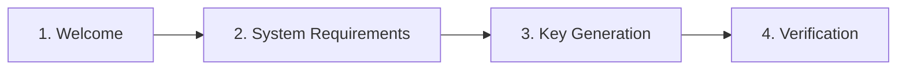

# Quick Start

This guide walks you through the initial setup wizard, server configuration, and everyday usage of the Expression Lab console.

:::important One-Time Setup Required
Before accessing the console, you must complete the onboarding wizard and add the generated configuration constants to your `wp-config.php` file.
:::

## Onboarding Wizard (Initial Setup)

Navigate to **Tools** > **Console** (or **Network Admin** > **Settings** > **Console** in WordPress Multisite). 

If the plugin is not yet configured, the onboarding wizard will launch automatically.

<div className="desktop-window">
  
</div>



### Welcome & Acknowledgement

Review the terms of use and check the confirmation box.

### System Requirements Check

The wizard automatically checks your server and browser environment. If any required requirement is marked as **Missing**, resolve it in your server configuration (see [Requirements](./installation.md#requirements)) before continuing.

### Key Generation & Passphrase

Enter a strong passphrase (minimum 8 characters):

* **Client-side derivation**: Your private key is derived locally in your browser using **Argon2id** and **Ed25519**.
* **In-memory session key**: Neither your passphrase nor the private key is stored in the database or written to disk; the key resides only in browser memory during your active session.

:::warning No recovery mechanism
Because the passphrase is never stored on the server, there is no way to recover or reset a forgotten passphrase. If you lose your passphrase, you must delete the configuration constants from `wp-config.php` and complete the onboarding wizard again.
:::

### Server Ownership Verification

The wizard generates three PHP constants that must be added to your `wp-config.php` file:

```php title="wp-config.php"
define( 'EXPRESSION_LAB_ADMIN_USER_ID', 1 );
define( 'EXPRESSION_LAB_ADMIN_PUBLIC_KEY', 'your-base64-public-key...' );
define( 'EXPRESSION_LAB_ADMIN_SALT', 'your-base64-salt...' );
```

1. Open `wp-config.php` on your server.
2. Paste the three lines before the `/* That's all, stop editing! Happy publishing. */` comment.
3. Save the file and reload the Expression Lab admin page.

Once WordPress detects all three constants, the plugin completes installation and unlocks access to the console.

---

## Accessing the REPL Console

### Single Administrator Restriction

Access to the interactive console is restricted to the administrator whose ID matches `EXPRESSION_LAB_ADMIN_USER_ID`. 

Other users can see the plugin entry in the WordPress admin menu, but accessing the page will display an **Access Restricted** notice and prevent any console operations or evaluations.

<div className="desktop-window">
  
</div>

### Unlocking Your Session

When accessing **Tools** > **Console**, you will be prompted with a lock screen:

<div className="desktop-window">
  
</div>

1. Enter the passphrase you chose during the onboarding process.
2. Click **Unlock** (or press <kbd>Enter</kbd>).
3. The browser derives the session key in memory and establishes a signed session.

---

## Using the REPL Console

The Expression Lab console provides an interactive development environment designed for real-time expression evaluation and data inspection.

<div className="desktop-window">
  
</div>

### 1. Editor and Expression Buffer

* **Input Prompt**: Type your DSL expression in the editor at the bottom of the console buffer.
* **Execution**: Press <kbd>Enter</kbd> to evaluate the expression.
* **Multiline Mode**: Press <kbd>Shift</kbd> + <kbd>Enter</kbd> to insert a newline without evaluating.
* **History Navigation**: Use <kbd>Alt</kbd> + <kbd>↑</kbd> and <kbd>Alt</kbd> + <kbd>↓</kbd> to cycle through previous commands.
* **Re-evaluating / Editing**: In the output buffer, click **Edit input** on any previous entry to load it back into the editor, or click **Run code** to re-evaluate it immediately.

### 2. Toolbar Controls

* **Clear**: Clears the console output history buffer and resets the editor.
* **User Context Switcher (`User`)**: Allows evaluating expressions in the context of another WordPress user account (changing the current user).
* **Site Switcher (`Site`)**: (*Multisite only*) Switches the execution context to target a specific subsite in the network.
* **Snippet Library (`Library`)**: Opens the snippet manager to save, load, import, or export reusable code snippets. Supports local disk storage via the browser's [File System Access API](https://developer.mozilla.org/en-US/docs/Web/API/File_System_API).
* **About**: Displays version information, licenses, and repository links.

### 3. Sidebar Outline Explorer

The collapsible sidebar on the right provides real-time documentation and code completion resources:

* **Objects**: Available global objects and classes.
* **Functions**: Available functions, parameters, and signatures.
* **Constants**: Available system and WordPress constants.
* **Click to Insert**: Clicking any item or function in the sidebar inserts its template into the editor prompt.

### 4. Status Bar (Footer)

The footer bar provides immediate visibility into your current runtime environment:

* **Sensitive Info Toggle** (`Eye icon`): Masks or reveals server and client IP addresses.
* **Runtime Info**: Displays active PHP version, WordPress version, and `WP_DEBUG` status.
* **Read-Only Status Indicators**: Shows whether write operations are restricted for the **Database**, **Filesystem**, and **Network** (e.g., `Database: Locked`).
* **Signature Status**: Displays the remaining validity countdown for the current cryptographic session challenge.

---

## Your First Expression

Once unlocked, verify that the console is operating properly by evaluating basic expressions:

```elscript
2 + 2 * 10
```

Press <kbd>Enter</kbd>. The result will appear in the output log:

```elscript
22
```

<div className="desktop-window">
  
</div>

That's it! You can now use the console to evaluate expressions and inspect your WordPress environment.

---

## Resetting the Configuration

If you need to change your passphrase or designate a different administrator:

1. Open your `wp-config.php` file in a text editor.
2. Remove or comment out the following constants:
   ```php title="wp-config.php"
   // define( 'EXPRESSION_LAB_ADMIN_USER_ID', ... );
   // define( 'EXPRESSION_LAB_ADMIN_PUBLIC_KEY', '...' );
   // define( 'EXPRESSION_LAB_ADMIN_SALT', '...' );
   ```
3. Save `wp-config.php`.
4. Return to your WordPress admin dashboard and navigate to **Tools** > **Console** to restart the onboarding wizard.

---

## Next Steps

* Read the [Basic Syntax](./basic-syntax) guide to explore available operators, functions, and expression grammar.
