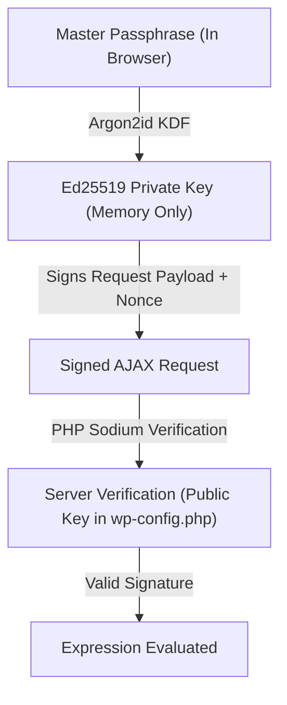

# Security

Expression Lab provides an interactive REPL console to evaluate expressions, query WordPress data structures, and inspect files. Because diagnostic queries and internal inspection are privileged operations, the plugin architecture incorporates multiple security layers and operational constraints.

:::danger Intended Environment & Security Status
* **Status**: Prototype / Alpha release.
* **Independent Audit**: This codebase **has not been audited** by an independent third-party cybersecurity firm. While it adheres to defensive engineering practices (AST sandboxing, Argon2id/Ed25519 key derivation, read-only defaults), vulnerabilities may still exist.
* **Prohibited Use Cases**: Expression Lab is **not intended or suitable** for live production sites, e-commerce stores handling cardholder/PII data, or governmental, military, and safety-critical infrastructures.
* **Liability**: Distributed under the GNU GPL v2.0+ license without warranty of any kind, explicit or implied.
:::

---

## How Access & Authentication Work

Expression Lab does not rely solely on standard WordPress cookies or nonces. Instead, it uses client-side asymmetric cryptography to authenticate every console operation:



### 1. In-Memory Key Derivation
* **Your passphrase remains in your browser**: When you unlock the console, your browser uses the native Web Crypto API and **Argon2id** to derive an **Ed25519** key pair in memory.
* **Ephemeral key storage**: The private key is held exclusively in memory (`window`) and is discarded when you close or reload the browser tab. The server never sees your passphrase or your private key.
* **Client-side request signing**: Every execution request is signed in your browser with Ed25519 and a timestamped payload.
* **Server-side signature verification**: The backend verifies the signature against the public key configured in `wp-config.php` using libsodium (`sodium_crypto_sign_verify_detached`).
* **Timestamp & nonce replay defense**: Requests include a Unix timestamp and must pass strict freshness checks to prevent replay attacks.

During initial setup, the public key generated in your browser must be added to your `wp-config.php` file:

```php title="wp-config.php"
define( 'EXPRESSION_LAB_ADMIN_USER_ID', 1 );
define( 'EXPRESSION_LAB_ADMIN_PUBLIC_KEY', 'your-base64-encoded-ed25519-public-key' );
define( 'EXPRESSION_LAB_ADMIN_SALT', 'your-base64-encoded-salt' );
```

Because the public key must be added to `wp-config.php`, accessing the console requires both knowledge of the master passphrase and write access to the server configuration. This provides defense-in-depth against compromised WordPress accounts that lack filesystem access.

---

## Access Control

Access to the console is restricted to the user whose ID matches `EXPRESSION_LAB_ADMIN_USER_ID`. Even if other users have the WordPress `administrator` role:
* They are shown a static "Access Restricted" screen.
* The frontend console application is never enqueued or delivered to their browser.
* All backend evaluation requests without a valid signature matching the configured public key are rejected with an HTTP 403 error.

### 4. Challenge-Response Protection
Every request sent to the server includes a short-lived challenge nonce and timestamp. The server verifies this nonce in constant time, ensures it has not expired, and immediately rotates it upon execution. This mitigates replay attacks from intercepted requests.

---

## Sandbox Boundaries and Operational Guards

Expression Lab includes operational controls to reduce the risk of accidental data corruption, server overload, or unintended network activity during expression evaluation:

### Database Mirroring (In-Memory SQLite)
* **Read-only by default**: Direct write queries (`INSERT`, `UPDATE`, `DELETE`, `DROP`, `ALTER`) against the active MySQL database are blocked when `EXPRESSION_LAB_DATABASE_READONLY` is active.
* **In-memory analytical queries**: When using `Database.mirror()`, data is extracted in batches and loaded into an ephemeral, in-memory SQLite3 database (`:memory:`). Analytical queries and joins run against this temporary in-memory copy without modifying your live database.
* **Query parameterization**: Compiled queries use `$wpdb->prepare()` with sanitized identifiers to prevent SQL injection.

### Filesystem Inspection
* **Read-only design**: The `Files` service provides diagnostics and telemetry for files. It contains no functions to create, edit, delete, or upload files.
* **Boundary confinement**: File paths are canonicalized and restricted to the WordPress root directory (`ABSPATH`). Attempts to traverse outside WordPress directories are blocked.
* **Bounded reading**: File reads are capped (e.g., maximum 256 KB for raw reads, backward streaming with a 1 MB safety stop for `tail()`) to limit PHP memory usage.

### Network Outbound Filtering
* **Protocol restriction**: Outbound requests via `Http` only permit standard `http` and `https` protocols.
* **Internal network protection**: Outbound requests are validated to block destinations pointing to local loopback addresses (`127.0.0.1`), private local network ranges (e.g., `10.0.0.0/8`, `192.168.0.0/16`), or cloud instance metadata endpoints (`169.254.169.254`).
* **Kill-switch**: Setting `EXPRESSION_LAB_NETWORK_READONLY = true` in `wp-config.php` completely disables all outbound HTTP requests from expressions.

### Execution Watchdog and Limits
To prevent accidental infinite loops or resource starvation:
* **CPU timeout limit**: By default, expressions are halted if execution takes longer than **2 seconds** (`EXPRESSION_LAB_MAX_EXECUTION_LIMIT`).
* **Operation counter**: Expressions that perform excessive iterations are automatically aborted by the execution watchdog before exhausting server resources.

---

## Best Practices for Site Administrators

To maintain environment security, follow these recommended practices:

1. **Always use HTTPS**: Modern browsers only enable the Web Crypto API in secure contexts (`https://` or `localhost`). Additionally, HTTPS protects your administrative session from network eavesdropping.
2. **Use a strong, unique passphrase**: Choose a passphrase that is distinct from your WordPress user password and difficult to guess.
3. **Protect your `wp-config.php` file**: Ensure your `wp-config.php` file has restrictive file permissions (such as `0600` or `0640`) so that other unprivileged system accounts on shared hosting cannot read it.
4. **Keep debug mode off in production**: `EXPRESSION_LAB_DEBUG_MODE` is reserved for local development and disables cryptographic signature checks. Never enable it on a live or public site.

---

## Emergency Reset & Lost Credentials

If you lose your master passphrase or need to revoke access to Expression Lab:

1. Connect to your server using SSH, SFTP, or your hosting file manager.
2. Open `wp-config.php` and remove the three authentication constants:
   ```php
   // Remove these lines to reset credentials:
   define( 'EXPRESSION_LAB_ADMIN_USER_ID', ... );
   define( 'EXPRESSION_LAB_ADMIN_PUBLIC_KEY', '...' );
   define( 'EXPRESSION_LAB_ADMIN_SALT', '...' );
   ```
3. Save the file.
4. Reload the Expression Lab admin page. The setup wizard will reappear, allowing you to generate a fresh passphrase and new cryptographic keys.

---

## Reporting Security Issues

If you discover a potential security bug or vulnerability in Expression Lab, please help us resolve it responsibly:

:::important Private Responsible Disclosure
**Please do not report security issues in public GitHub issues or public forums.** Public disclosure puts other users at risk before a fix can be prepared.
:::

1. Go to the repository on GitHub: [github.com/andersonsalas/expressionlab](https://github.com/andersonsalas/expressionlab).
2. Click the **Security** tab at the top.
3. Click **Report a vulnerability** under the *Advisories* section.
4. Provide a description of the issue and steps to reproduce.

We will review your report promptly, coordinate a fix, and release an update.

As an independent, community-driven, open-source project, Expression Lab does not offer monetary bug bounties. However, valid disclosures are deeply appreciated, and we will gladly credit you in the release notes and changelog (unless you prefer to remain anonymous).
