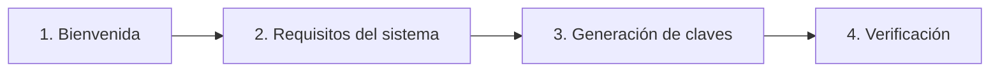

# Inicio rápido

Esta guía detalla el proceso para completar la configuración inicial, registrar las credenciales en el servidor y utilizar la consola interactiva de Expression Lab.

:::important Configuración inicial obligatoria
Antes de acceder a la consola, es necesario completar el asistente de bienvenida y añadir las constantes de configuración generadas al archivo `wp-config.php`.
:::

## Asistente de configuración inicial (*Onboarding*)

En el panel de WordPress, acceder a **Herramientas** > **Consola** (o a **Administración de la red** > **Ajustes** > **Consola** en entornos WordPress Multisite).

Si el plugin aún no ha sido configurado, el asistente se inicia de inmediato.

<div className="desktop-window">
  
</div>



### Bienvenida y aceptación

Revisar los términos de uso y marcar la casilla de confirmación.

### Comprobación de requisitos del sistema

El asistente verifica el entorno del servidor y del navegador. Si algún componente obligatorio figura como **No disponible (Missing)**, debe corregirse en la configuración del servidor (ver la sección de [Requisitos](./installation.md#requisitos)) antes de avanzar.

### Generación de claves

Definir una contraseña (*passphrase*) segura (mínimo 8 caracteres):

* **Derivación en el navegador**: La clave privada se deriva en el navegador mediante **Argon2id** y **Ed25519**.
* **Clave de sesión en memoria**: Ni la contraseña ni la clave privada se almacenan en la base de datos ni se escriben en disco; la clave reside solo en la memoria del navegador durante la sesión activa.

:::warning Sin mecanismo de recuperación
Dado que la contraseña nunca se almacena en el servidor, no existe ningún mecanismo para recuperarla o restablecerla ante un olvido. En caso de pérdida, es necesario eliminar las constantes de configuración en `wp-config.php` y reiniciar el asistente inicial.
:::

### Verificación de propiedad del servidor

El asistente generará tres constantes de PHP que deben añadirse al archivo `wp-config.php`:

```php title="wp-config.php"
define( 'EXPRESSION_LAB_ADMIN_USER_ID', 1 );
define( 'EXPRESSION_LAB_ADMIN_PUBLIC_KEY', 'tu-clave-publica-base64...' );
define( 'EXPRESSION_LAB_ADMIN_SALT', 'tu-salt-base64...' );
```

1. Abrir el archivo `wp-config.php` en el servidor.
2. Pegar las tres líneas antes del comentario `/* That's all, stop editing! Happy publishing. */`.
3. Guardar el archivo y recargar la página de administración de Expression Lab.

En cuanto WordPress detecte las tres constantes, el plugin finalizará la instalación y habilitará el acceso a la consola.

---

## Acceso a la consola REPL

### Restricción a un administrador específico

El acceso a la consola interactiva queda restringido al administrador cuyo ID coincida con `EXPRESSION_LAB_ADMIN_USER_ID`.

Cualquier otro usuario administrador que intente acceder verá una pantalla de aviso de **Acceso Restringido** y no podrá ejecutar expresiones ni consultar datos:

<div className="desktop-window">
  
</div>

### Desbloqueo de la sesión

Al acceder a **Herramientas** > **Consola**, se muestra la pantalla de desbloqueo:

<div className="desktop-window">
  
</div>

1. Introducir la contraseña definida durante la configuración inicial.
2. Pulsar **Desbloquear** (o presionar <kbd>Enter</kbd>).
3. El navegador deriva la clave criptográfica en memoria e inicia la sesión firmada.

---

## Uso de la consola REPL

La consola de Expression Lab ofrece un entorno interactivo optimizado para la evaluación de expresiones y la inspección de datos en tiempo real.

<div className="desktop-window">
  
</div>

### 1. Editor y búfer de expresiones

* **Línea de entrada**: Entrada de expresiones en el editor situado en la parte inferior de la consola.
* **Ejecución**: Pulsar <kbd>Enter</kbd> para evaluar la expresión.
* **Modo multilínea**: Presionar <kbd>Shift</kbd> + <kbd>Enter</kbd> para insertar un salto de línea sin ejecutar.
* **Navegación por el historial**: <kbd>Alt</kbd> + <kbd>↑</kbd> y <kbd>Alt</kbd> + <kbd>↓</kbd> para recuperar expresiones previas.
* **Reevaluar / Editar**: En el panel de resultados, el botón **Editar entrada** carga comandos previos en el editor, mientras que **Ejecutar código** permite reevaluarlos.

### 2. Controles de la barra de herramientas

* **Limpiar**: Vacía el búfer de salida de la consola y reinicia el editor.
* **Selector de contexto de usuario (`Usuario`)**: Permite evaluar expresiones simulando el contexto de cualquier cuenta de usuario de WordPress (conmutando el usuario activo de la sesión).
* **Selector de sitio (`Sitio`)**: (*Exclusivo para Multisite*) Modifica el contexto de ejecución para consultar un subsitio específico de la red.
* **Biblioteca de snippets (`Biblioteca`)**: Abre el panel de fragmentos de código para guardar, cargar, importar o exportar expresiones reutilizables. Admite sincronización local con el disco mediante la [File System Access API](https://developer.mozilla.org/es/docs/Web/API/File_System_Access_API) del navegador.
* **Acerca de**: Muestra información sobre la versión, licencias y enlaces al repositorio.

### 3. Explorador lateral (Outline)

El panel lateral desplegable a la derecha brinda documentación contextual y autocompletado en tiempo real:

* **Objetos**: Servicios globales y modelos disponibles en el entorno.
* **Funciones**: Catálogo de funciones expuestas con sus parámetros y firmas.
* **Constantes**: Constantes del sistema y de WordPress disponibles.
* **Clic para insertar**: Al pulsar sobre cualquier elemento del panel lateral, su plantilla se inserta en el editor.

### 4. Barra de estado

La barra inferior ofrece información clave sobre el entorno de ejecución activo:

* **Ocultar/mostrar datos sensibles** (`Icono de Ojo`): Muestra u oculta las direcciones IP del servidor y del cliente.
* **Información del entorno**: Indica la versión activa de PHP, la versión de WordPress y el estado de `WP_DEBUG`.
* **Indicadores de solo lectura**: Muestra si las operaciones de escritura están restringidas para **Base de datos**, **Sistema de archivos** y **Red** (por ejemplo, `Database: Bloqueado`).
* **Validez de la firma**: Cuenta regresiva con el tiempo restante de validez del desafío criptográfico activo.

---

## Primera expresión de prueba

Tras desbloquear la consola, es posible comprobar la evaluación con una operación básica:

```elscript
2 + 2 * 10
```

Pulsar <kbd>Enter</kbd>. El resultado se mostrará en el panel de salida:

```elscript
22
```

<div className="desktop-window">
  
</div>

A partir de este punto, la consola queda disponible para evaluar expresiones complejas e inspeccionar las estructuras internas de WordPress.

---

## Restablecimiento de la configuración

Para cambiar la contraseña o designar a otro usuario administrador:

1. Abrir el archivo `wp-config.php` en un editor de texto.
2. Eliminar o comentar las constantes de autenticación:
   ```php title="wp-config.php"
   // define( 'EXPRESSION_LAB_ADMIN_USER_ID', ... );
   // define( 'EXPRESSION_LAB_ADMIN_PUBLIC_KEY', '...' );
   // define( 'EXPRESSION_LAB_ADMIN_SALT', '...' );
   ```
3. Guardar los cambios en `wp-config.php`.
4. Acceder nuevamente a **Herramientas** > **Consola** para reiniciar el asistente de configuración.

---

## Siguientes pasos

* Consulta de la guía de [Sintaxis básica](./basic-syntax) para conocer los operadores, funciones y la gramática del motor de expresiones.
