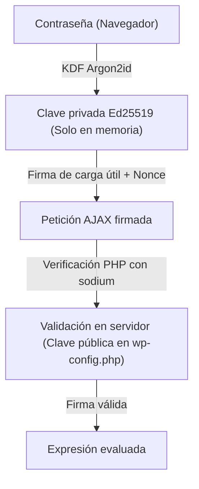

# Seguridad

Expression Lab proporciona una consola REPL interactiva para evaluar expresiones, consultar estructuras de datos de WordPress e inspeccionar archivos. Dado que ejecutar consultas de diagnóstico e inspeccionar datos internos son operaciones privilegiadas, la arquitectura del plugin incorpora múltiples capas de seguridad y restricciones operativas.

:::danger Entorno previsto y estado de seguridad
* **Estado**: Prototipo / Versión Alpha.
* **Auditoría independiente**: Este código **no ha sido auditado** por una firma independiente de ciberseguridad. Si bien aplica prácticas de ingeniería defensiva (sandbox AST, derivación de claves con Argon2id/Ed25519, valores de solo lectura por diseño), aún pueden existir vulnerabilidades.
* **Casos de uso prohibidos**: Se **desaconseja categóricamente y no es apto** el uso de Expression Lab en sitios en producción activos, tiendas de comercio electrónico que gestionen datos de titulares de tarjetas o información personal identificable (PII), o infraestructuras gubernamentales, militares o críticas para la seguridad.
* **Responsabilidad**: Distribuido bajo la licencia GNU GPL v2.0+ sin garantía de ningún tipo, explícita o implícita.
:::

---

## Cómo funcionan el acceso y la autenticación

Expression Lab no depende solo de cookies de sesión o *nonces* convencionales de WordPress. En su lugar, utiliza criptografía asimétrica en el cliente para autenticar y autorizar cada operación en la consola:



### 1. Derivación de claves en memoria sin almacenamiento en servidor
* **La contraseña permanece en el navegador**: Al desbloquear la consola, el navegador utiliza la Web Crypto API nativa y **Argon2id** para derivar un par de claves **Ed25519** en memoria.
* **Sin credenciales en la base de datos**: Ni la contraseña maestra ni la clave privada generada se almacenan jamás en la base de datos de WordPress ni se escriben en el disco del servidor.
* **Memoria de sesión volátil**: La clave privada reside solo en la memoria RAM del navegador mientras la pestaña permanece abierta; se destruye de inmediato al bloquear la consola o cerrar la pestaña.

### 2. Comprobación de propiedad del servidor
Durante la configuración inicial, la clave pública generada en el navegador debe registrarse en el archivo `wp-config.php`:

```php
define( 'EXPRESSION_LAB_ADMIN_USER_ID', 1 );
define( 'EXPRESSION_LAB_ADMIN_PUBLIC_KEY', '...' );
define( 'EXPRESSION_LAB_ADMIN_SALT', '...' );
```

Al requerir que la clave pública se defina en `wp-config.php`, el acceso a la consola exige tanto el conocimiento de la contraseña maestra como acceso de escritura a la configuración del servidor en el sistema de archivos. Esto proporciona defensa en profundidad ante posibles cuentas de WordPress comprometidas que carezcan de acceso al sistema de archivos.

### 3. Restricción a un administrador específico
El acceso a la consola queda limitado al usuario cuyo ID coincide con `EXPRESSION_LAB_ADMIN_USER_ID`. Aunque existan otros usuarios con rol de `administrator`:
* Se les mostrará una pantalla fija de **Acceso Restringido**.
* Los scripts y estilos de la consola nunca se encolan ni se envían a sus navegadores.
* Toda petición al backend que carezca de una firma válida verificada con la clave pública configurada es rechazada con un código de estado HTTP 403.

### 4. Protección contra ataques de repetición (*challenge-response*)
Cada petición enviada al servidor incluye una marca de tiempo y un desafío criptográfico (*nonce*) de vida corta. El servidor valida este desafío en tiempo constante, comprueba que no haya expirado y lo invalida de inmediato tras su uso. Esto mitiga los ataques de repetición (*replay attacks*) a partir de peticiones interceptadas.

---

## Restricciones del sandbox y límites operativos

Expression Lab incluye controles operativos para mitigar el riesgo de modificación accidental de datos, sobrecarga del servidor o comunicaciones de red no deseadas durante la evaluación de expresiones:

### Replicación de base de datos (SQLite en memoria)
* **Solo lectura por defecto**: Las sentencias de modificación directa (`INSERT`, `UPDATE`, `DELETE`, `DROP`, `ALTER`) sobre la base de datos MySQL activa están bloqueadas cuando `EXPRESSION_LAB_DATABASE_READONLY` está habilitado.
* **Consultas analíticas en memoria**: Al invocar `Database.mirror()`, los registros se replican en lotes dentro de una base de datos efímera SQLite3 en memoria (`:memory:`). Las consultas analíticas y uniones (*joins*) se ejecutan sobre esta réplica temporal sin alterar la base de datos activa.
* **Parametrización de consultas**: Toda consulta generada utiliza `$wpdb->prepare()` con identificadores saneados para prevenir inyecciones SQL.

### Inspección del sistema de archivos
* **Diseño de solo lectura**: La utilidad `Files` proporciona capacidades de telemetría y diagnóstico. No incluye funciones para crear, sobrescribir ni eliminar archivos.
* **Restricción a la raíz (`ABSPATH`)**: Las rutas se resuelven y canonicalizan mediante `realpath()`. Cualquier intento de salto de directorios (*path traversal*) fuera de `ABSPATH` es interceptado y bloqueado.
* **Límites de lectura en memoria**: Las operaciones de lectura tienen topes definidos (por ejemplo, 256 KB para lectura directa y 1 MB para `tail()`) para limitar el consumo de memoria asignada a PHP.

### Aislamiento de red saliente
* **Restricción de protocolos**: Las peticiones salientes mediante `Http` admiten solo los protocolos estándar `http` y `https`.
* **Protección contra SSRF**: Se interceptan peticiones destinadas a direcciones locales de bucle cerrado (*loopback* como `127.0.0.1`), rangos de redes locales privadas (RFC 1918 como `10.0.0.0/8`, `192.168.0.0/16`) o servicios de metadatos de proveedores en la nube (`169.254.169.254`).
* **Interruptor global (*Kill-switch*)**: Al definir `EXPRESSION_LAB_NETWORK_READONLY = true` en `wp-config.php`, se deshabilita por completo cualquier petición HTTP saliente desde las expresiones.

### Guardián de ejecución y límites de tiempo
Para prevenir bloqueos involuntarios o consumo desmedido de CPU:
* **Límite de tiempo de ejecución**: De forma predeterminada, la evaluación se interrumpe si supera los **2 segundos** de procesamiento (`EXPRESSION_LAB_MAX_EXECUTION_LIMIT`).
* **Contador de cuota de operaciones**: Las expresiones con recursión excesiva o iteraciones masivas son interrumpidas por el guardián de operaciones antes de degradar el rendimiento del servidor.

---

## Buenas prácticas para administradores

Para mantener la seguridad del entorno, se recomienda seguir estas buenas prácticas:

1. **Utilizar siempre HTTPS**: Los navegadores restringen la Web Crypto API a contextos seguros (`https://` o `localhost`). Además, HTTPS previene la interceptación de tráfico en tránsito.
2. **Elegir una contraseña sólida y exclusiva**: Emplear una contraseña diferente a la cuenta de usuario de WordPress y difícil de deducir.
3. **Proteger los permisos de `wp-config.php`**: Verificar que los permisos de lectura del archivo `wp-config.php` sean restrictivos (por ejemplo, `0600` o `0640`) para evitar accesos indebidos desde otras cuentas del servidor.
4. **Mantener el modo de depuración desactivado en producción**: `EXPRESSION_LAB_DEBUG_MODE` está reservado para desarrollo interno y suprime la verificación de firmas criptográficas. Nunca debe habilitarse en entornos de producción.

---

## Restablecimiento de emergencia

En caso de pérdida de la contraseña maestra o necesidad de revocar el acceso a la consola:

1. Conectarse al servidor mediante SSH, SFTP o el panel de administración del proveedor de hosting.
2. Abrir el archivo `wp-config.php` y eliminar las tres constantes de autenticación:
   ```php
   // Elimina estas líneas para invalidar el acceso actual:
   define( 'EXPRESSION_LAB_ADMIN_USER_ID', ... );
   define( 'EXPRESSION_LAB_ADMIN_PUBLIC_KEY', '...' );
   define( 'EXPRESSION_LAB_ADMIN_SALT', '...' );
   ```
3. Guardar los cambios.
4. Recargar la interfaz de Expression Lab en WordPress. El asistente de configuración inicial vuelve a desplegarse para generar una nueva contraseña y credenciales.

---

## Reporte responsable de vulnerabilidades

Ante la detección de un posible fallo de seguridad en Expression Lab, se deben seguir las pautas de divulgación responsable:

:::important Divulgación responsable privada
**No publicar incidencias de seguridad en los *issues* abiertos de GitHub ni en foros públicos.** La divulgación pública expone a otros usuarios antes de que exista un parche disponible.
:::

1. Acceder al repositorio en GitHub: [github.com/andersonsalas/expressionlab](https://github.com/andersonsalas/expressionlab).
2. Entrar en la pestaña **Security**.
3. Pulsar en **Report a vulnerability** dentro del panel *Advisories*.
4. Detallar la descripción técnica del problema y los pasos para reproducirlo.

El reporte se revisará con prioridad para coordinar una solución y publicar una versión actualizada.

Expression Lab es un proyecto independiente de código abierto, por lo que no cuenta con un programa de recompensas económicas (*bug bounty*). Se reconocen las contribuciones responsables en las notas de lanzamiento (salvo que se prefiera mantener el anonimato).
