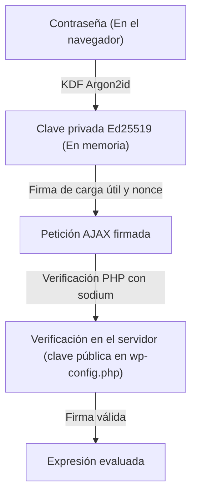

# Seguridad

Expression Lab proporciona una consola interactiva REPL para evaluar expresiones, consultar estructuras de datos de WordPress e inspeccionar archivos. Dado que las consultas de diagnóstico y la inspección interna constituyen operaciones privilegiadas, la arquitectura del plugin incorpora múltiples capas de seguridad y restricciones operativas.

:::danger Entorno previsto y estado de seguridad
* **Estado**: Prototipo / Versión Alpha.
* **Auditoría independiente**: Esta base de código **no ha sido auditada** por una firma externa de ciberseguridad. Aunque se aplican prácticas de ingeniería defensiva (aislamiento de AST, derivación de claves con Argon2id/Ed25519 y opciones por defecto de solo lectura), aún pueden existir vulnerabilidades.
* **Casos de uso prohibidos**: Expression Lab **no está destinado ni resulta apto** para sitios activos en producción, tiendas de comercio electrónico que procesen datos de titulares de tarjetas o información personal identificable (PII), ni infraestructuras gubernamentales, militares o críticas para la seguridad.
* **Responsabilidad**: Distribuido bajo la licencia GNU GPL v2.0+ sin garantía de ningún tipo, explícita o implícita.
:::

---

## Cómo funcionan el acceso y la autenticación

Expression Lab no depende solo de las cookies o nonces habituales de WordPress. En su lugar, se emplea criptografía asimétrica en el cliente para autenticar cada operación de la consola:


```mermaid
graph TD
    A["Contraseña (En el navegador)"] -->|KDF Argon2id| B["Clave privada Ed25519 (En memoria)"]
    B -->|Firma de carga útil y nonce| C["Petición AJAX firmada"]
    C -->|Verificación PHP con sodium| D["Verificación en el servidor (clave pública en wp-config.php)"]
    D -->|Firma válida| E["Expresión evaluada"]
```

### Derivación de claves en memoria

* **La contraseña permanece en el navegador**: Al desbloquear la consola, el navegador utiliza la Web Crypto API nativa junto con **Argon2id** para derivar un par de claves **Ed25519** en memoria.
* **Almacenamiento efímero de claves**: La clave privada se conserva de forma exclusiva en memoria (`window`) y se descarta al cerrar o recargar la pestaña del navegador. El servidor nunca tiene acceso a la contraseña ni a la clave privada.
* **Firma de peticiones en el cliente**: Cada petición de ejecución se firma en el navegador mediante Ed25519 con una carga útil fechada por marca de tiempo.
* **Verificación de firma en el servidor**: El backend valida la firma contra la clave pública configurada en `wp-config.php` a través de libsodium (`sodium_crypto_sign_verify_detached`).
* **Defensa contra repetición mediante marcas de tiempo y nonces**: Las peticiones incluyen una marca de tiempo Unix y deben superar comprobaciones estrictas de vigencia para prevenir ataques de repetición.

Durante la configuración inicial, la clave pública generada en el navegador se debe añadir al archivo `wp-config.php`:

```php title="wp-config.php"
define( 'EXPRESSION_LAB_ADMIN_USER_ID', 1 );
define( 'EXPRESSION_LAB_ADMIN_PUBLIC_KEY', 'clave-publica-ed25519-en-base64' );
define( 'EXPRESSION_LAB_ADMIN_SALT', 'salt-en-base64' );
```

Al requerir la incorporación de la clave pública en `wp-config.php`, el acceso a la consola exige tanto el conocimiento de la contraseña maestra como permisos de escritura en la configuración del servidor. Esto proporciona defensa en profundidad ante cuentas de WordPress comprometidas que carezcan de acceso al sistema de archivos.

---

## Control de acceso

El acceso a la consola está restringido al usuario cuyo identificador coincida con `EXPRESSION_LAB_ADMIN_USER_ID`. Incluso si otros usuarios cuentan con el rol de `administrator` en WordPress:
* Se les muestra una pantalla estática de «Acceso restringido».
* La aplicación de frontend de la consola nunca se encola ni se envía a sus navegadores.
* Toda petición de evaluación al backend sin una firma válida que concuerde con la clave pública configurada es rechazada con un error HTTP 403.

### Protección por desafío y respuesta
Cada petición enviada al servidor incluye una marca de tiempo y un nonce de desafío de corta duración. El servidor comprueba este nonce en tiempo constante, verifica que no haya expirado y procede a rotarlo de inmediato tras la ejecución. Esto mitiga ataques de repetición a partir de peticiones interceptadas.

---

## Límites del entorno aislado y controles operativos

Expression Lab incorpora controles operativos destinados a reducir el riesgo de corrupción accidental de datos, sobrecarga del servidor o actividad de red no prevista durante la evaluación de expresiones:

### Replicación de base de datos (SQLite en memoria)
* **Solo lectura por defecto**: Las consultas directas de escritura (`INSERT`, `UPDATE`, `DELETE`, `DROP`, `ALTER`) contra la base de datos MySQL activa quedan bloqueadas cuando `EXPRESSION_LAB_DATABASE_READONLY` está habilitado.
* **Consultas analíticas en memoria**: Al utilizar `Database.mirror()`, los datos se extraen por lotes y se cargan en una base de datos efímera SQLite3 en memoria (`:memory:`). Las consultas analíticas y combinaciones (*joins*) se ejecutan sobre esta copia temporal sin alterar la base de datos activa.
* **Parametrización de consultas**: Las consultas compiladas emplean `$wpdb->prepare()` con identificadores saneados a fin de prevenir inyecciones SQL.

### Inspección del sistema de archivos
* **Diseño de solo lectura**: El servicio `Files` ofrece funciones de diagnóstico y telemetría sobre archivos. No contiene funciones para crear, editar, eliminar o subir archivos.
* **Confinamiento perimetral**: Las rutas de archivos se normalizan y quedan restringidas al directorio raíz de WordPress (`ABSPATH`). Cualquier intento de evasión hacia directorios externos queda bloqueado.
* **Lectura acotada**: Las lecturas de archivos poseen un límite máximo (por ejemplo, hasta 256 KB en lecturas directas y transmisión inversa con tope de seguridad de 1 MB para `tail()`) para moderar el uso de memoria en PHP.

### Filtrado de tráfico saliente de red
* **Restricción de protocolos**: Las peticiones salientes a través de `Http` solo autorizan los protocolos estándar `http` y `https`.
* **Protección de redes internas**: Las peticiones salientes se validan para bloquear destinos dirigidos a direcciones de bucle local (`127.0.0.1`), rangos de red local privada (por ejemplo, `10.0.0.0/8`, `192.168.0.0/16`) o puntos de enlace de metadatos de instancias en la nube (`169.254.169.254`).
* **Mecanismo de corte (*kill-switch*)**: Al definir `EXPRESSION_LAB_NETWORK_READONLY = true` en `wp-config.php`, se deshabilitan por completo todas las peticiones HTTP salientes generadas desde las expresiones.

### Monitor de ejecución y límites
Para evitar bucles infinitos involuntarios o el agotamiento de recursos:
* **Límite de tiempo de CPU**: Por defecto, la evaluación de una expresión se interrumpe si la ejecución toma más de **2 segundos** (`EXPRESSION_LAB_MAX_EXECUTION_LIMIT`).
* **Contador de operaciones**: Las expresiones que realizan iteraciones en exceso se abortan de forma automática por medio del monitor de ejecución antes de agotar los recursos del servidor.

---

## Buenas prácticas para la administración del sitio

Para preservar la seguridad del entorno, se sugieren las siguientes prácticas:

1. **Emplear siempre HTTPS**: Los navegadores modernos solo habilitan la Web Crypto API en contextos seguros (`https://` o `localhost`). Además, HTTPS resguarda la sesión administrativa frente a escuchas no autorizadas en la red.
2. **Utilizar una contraseña sólida y exclusiva**: Se recomienda definir una contraseña distinta a la de la cuenta de usuario de WordPress y de difícil deducción.
3. **Proteger el archivo `wp-config.php`**: Se debe comprobar que el archivo `wp-config.php` cuente con permisos restrictivos (tales como `0600` o `0640`) con el fin de evitar que otras cuentas de sistema sin privilegios en alojamientos compartidos puedan leerlo.
4. **Mantener desactivado el modo de depuración en producción**: `EXPRESSION_LAB_DEBUG_MODE` está reservado para desarrollo local y desactiva las comprobaciones de firmas criptográficas. No debe habilitarse en sitios activos o de acceso público.

---

## Restablecimiento de emergencia y credenciales perdidas

En caso de extravío de la contraseña maestra o de requerir la revocación del acceso a Expression Lab:

1. Conéctese al servidor mediante SSH, SFTP o el administrador de archivos de su proveedor de hosting.
2. Abra `wp-config.php` y elimine las tres constantes de autenticación:
   ```php
   // Se eliminan estas líneas para restablecer las credenciales:
   define( 'EXPRESSION_LAB_ADMIN_USER_ID', ... );
   define( 'EXPRESSION_LAB_ADMIN_PUBLIC_KEY', '...' );
   define( 'EXPRESSION_LAB_ADMIN_SALT', '...' );
   ```
3. Guarde el archivo.
4. Recargue la página de administración de Expression Lab. El asistente de configuración aparecerá de nuevo, lo cual permitirá generar una contraseña limpia y nuevas claves criptográficas.

---

## Notificación de incidencias de seguridad

Si descubre algún fallo de seguridad o vulnerabilidad en Expression Lab, por favor, ayúdenos a resolverlo de forma responsable:

:::important Divulgación responsable privada
**Por favor, no reporte incidencias de seguridad en publicaciones abiertas de GitHub ni en foros públicos.** La divulgación abierta expone a otros usuarios a riesgos antes de que se pueda publicar un parche.
:::

1. Vaya al repositorio en GitHub: [github.com/andersonsalas/expressionlab](https://github.com/andersonsalas/expressionlab).
2. Vaya a la pestaña **Security** en la parte superior.
3. Haga clic en **Report a vulnerability** dentro de la sección *Advisories*.
4. Describa el problema junto con los pasos para reproducirlo.

Su reporte se revisará a la brevedad para coordinar una corrección y publicar un parche.

Al ser un proyecto independiente de código abierto impulsado por la comunidad, Expression Lab no ofrece recompensas económicas (*bug bounties*). No obstante, los reportes válidos son muy apreciados y se le otorgará el debido crédito en las notas de la versión y en el registro de cambios (a menos que prefiera mantener el anonimato).
